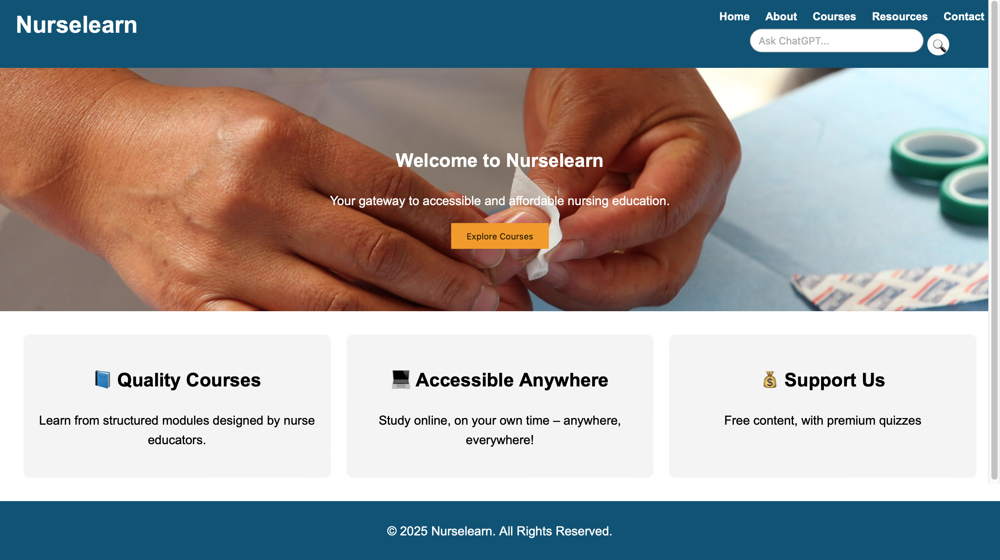
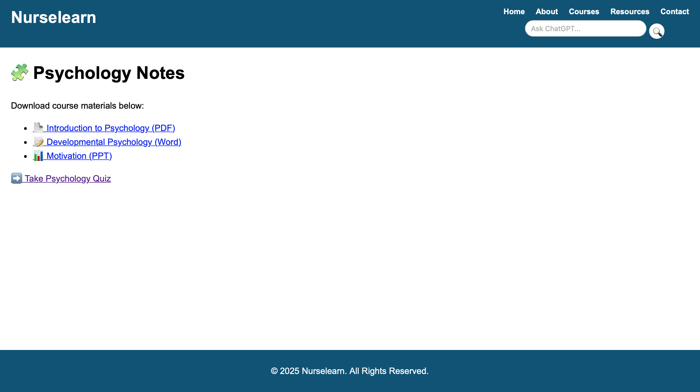
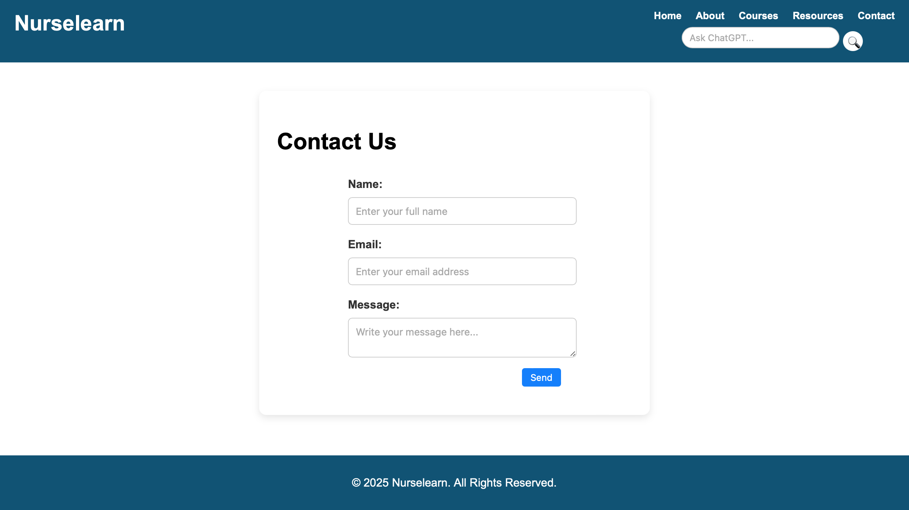

# 📦 Final Assignment: Build, Organize, and Deploy a Multipage Website

You're now ready to bring everything together—HTML, CSS, JavaScript, planning, structure, and deployment. This final project challenges you to **conceptualize, build, and deploy a multi-page website** that is responsive, interactive, and ready for the real world.

This assignment will guide you from planning your site all the way to deploying it online. Let’s make your project *production-worthy*! 🚀

---

## 🌐🎯 Part 1: Planning and Organizing a Multipage Website

Before you write any code, take time to plan:

* Define your website's purpose (portfolio, product showcase, blog, etc.)
* Outline 3–5 pages (e.g., Home, About, Services, Contact, Gallery)
* Sketch or describe the layout of each page
* Map out internal navigation (how pages link to one another)

**Goal:** Show intentional structure and user journey across the site.

---

## 🌍💻 Part 2: Build the Website Using HTML5, CSS, and JavaScript

Using your plan, begin building:

* Use HTML5 for semantic structure
* Apply CSS for responsive layout, styling, and animations
* Use JavaScript to add interactivity (menus, forms, toggles, dynamic content)

Each page should:

* Be mobile-responsive
* Share a consistent layout/header/footer
* Include at least one interactive element (e.g., form validation, toggle menu, animation on scroll)

**Goal:** Integrate everything you’ve learned in a cohesive, functioning project.

---

## 🛠️🚀 Part 3: Best Practices for Code Organization

Before deployment, refactor your project to follow production-friendly practices:

* Organize files in folders (`/css`, `/js`, `/images`, etc.)
* Write clean, modular, and commented code
* Use meaningful file names and relative paths
* Validate your HTML/CSS and test on different screen sizes

**Goal:** Prepare your codebase to be readable, maintainable, and scalable.

---

## 🌐🚀 Part 4: Introduction to Hosting and Deployment

Once your project is complete, choose a method to **host your site online**.

You can use:

* **GitHub Pages** (great for portfolios and static sites)
* **Netlify** (powerful CI/CD features and easy form support)
* **Vercel** (lightning-fast deployment for frontend projects)

Deploy your project and confirm that:

* All links and scripts work
* It loads properly on mobile and desktop
* It has a clear, shareable URL

**Goal:** Publish your work online and make it accessible to the world.

---

## Deliverables

1. A GitHub repository containing:

   * Your complete project code, properly organized
   * A `README.md` file explaining your project purpose, structure, and live URL
2. A live deployed website (hosted via GitHub Pages, Netlify, or Vercel)

---

## Outcome

* Clarity and thoroughness of planning documentation
* Proper use of HTML5, CSS, and JavaScript across multiple pages
* Responsive and accessible design
* Clean, well-organized, and commented code
* Successful live deployment with a working link
* Evidence of following best practices

========================================================
========================================================

# Student's README
# 🩺 Lumenra – Nursing Education Platform

Lumenra is a **multi-page responsive website** built to support nursing students with structured resources and quizzes in **Anatomy & Physiology, Mental Health & Psychiatric Nursing, and Psychology**.  

This project was created for the **Final Assignment: Build, Organize, and Deploy a Multipage Website** and is deployed on **Vercel** for real-world accessibility.  

---

## 📌 Purpose

The purpose of Lumenra is to:  
- Provide **downloadable study resources** (PDF, Word, PPT).  
- Offer **interactive quizzes**, including Google Form integrations.  
- Include a **direct AI-powered ChatGPT search tool** for quick Q&A.  
- Demonstrate a real-world, scalable **education platform** built using HTML, CSS, and JavaScript.  

---

## ✨ Features

- 📖 **Notes Page** – Download structured lecture materials.  
- 📝 **Quizzes Page** – Practice quizzes hosted internally and via Google Forms.  
- 🤖 **AI ChatGPT Search** – Ask AI-powered questions directly from the header.  
- 📱 **Responsive Design** – Mobile-first layout using Flexbox and media queries.  
- 📨 **Contact Form** – Professionally styled form with validation and placeholders.  
- 📌 **Consistent Layout** – Shared header, nav, and footer across all pages.  

---

## 🌐 Site Structure

The website has **4 main pages**:

1. **Home (index.html)**  
   - Introduction to Lumenra.  
   - Navigation bar with AI search.  
   - Hero section and featured subjects.  

2. **Notes (notes.html)**  
   - Downloadable PDF, Word, and PPT study notes.  

3. **Quizzes (quizzes.html)**  
   - Internal multiple-choice quizzes.  
   - External quizzes via Google Forms.  

4. **Contact (contact.html)**  
   - Contact form with styled placeholders and a compact **Send** button aligned right.  

---

## 📂 Project Structure

lumenra/
│
├── index.html # Home page
├── about.html # About page
├── courses.html # Courses page
├── contact.html # Contact page
├── resources.html # Resources page
│
├── css/
│ └── style.css # Global stylesheet
│
├── js/
│ └── script.js # JavaScript for interactivity
│
├── images/ # Images and screenshots
│ ├── home.png
│ ├── notes.png
│ ├── quizzes.png
│ └── contact.png
│
└── README.md # Documentation

---

## 🖼️ Screenshots

### 🏠 Home Page

### 📖 Notes Page

### 📝 Quizzes Page

### ✉️ Contact Page

---

## 💻 Usage

### Navigation
- Use the **header navigation bar** (right-aligned) to move between pages.  
- Use the **AI ChatGPT search bar** to ask questions — type and click the blue search icon.  

### Notes
- Click **View Notes** → Download study material (PDF, Word, PPT).  

### Quizzes
- Click **Take Quiz** → Attempt internal quizzes.  
- Some quizzes open as **Google Forms** in a new tab.  

### Contact
- Fill in **Name, Email, and Message**.  
- Click **Send** → The form validates inputs before submission.  

---

## 🚀 Deployment

This project is deployed with **Vercel**.  

### Prerequisites
- [GitHub Account](https://github.com)  
- [Vercel Account](https://vercel.com)  

Live Demo

👉 https://nurselearn.vercel.app

(Replace with your actual deployed link after publishing.)

🛠️ Tech Stack

Frontend: HTML5, CSS3, JavaScript

Hosting: Vercel

External Tools: Google Forms (for quizzes), OpenAI (ChatGPT integration - opens new tab)

📜 License

This project is licensed under the MIT License – free to use, modify, and distribute for educational purposes.

👨‍💻 Author

Joseph Sakala, C.J.

Nurse Educator | Tech Enthusiast